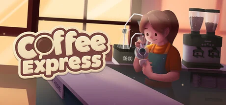
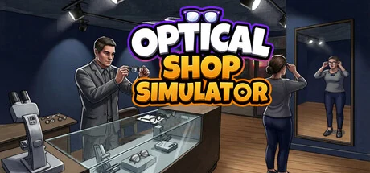
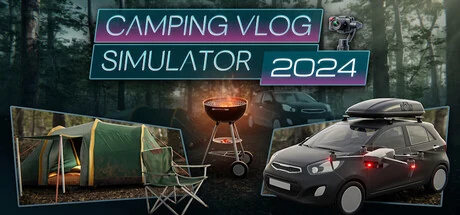
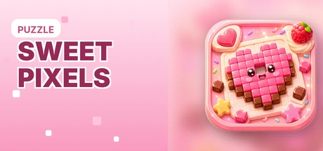

<!-- Not wrapped in a link: GitHub auto-links every , and an <a> is not a
     valid child of <picture>, so the browser hoists the image out of both the
     picture and any enclosing anchor — leaving an empty picture and a
     duplicate image. Theme-aware pictures have to stay unlinked here. -->
<picture>
  <source media="(prefers-color-scheme: dark)" srcset="assets/hero-dark.svg">
  <source media="(prefers-color-scheme: light)" srcset="assets/hero-light.svg">
  
</picture>

  I build and ship commercial games at <b>Vitrum Games</b> in İzmir, Türkiye. 
  10+ games shipped and 20+ developed, across Steam, Google Play and the App Store. An RPG / tower-defense is in production for 2027.

## Selected work

<table>
<tr>
<td width="50%" align="center">
   
  <b>Coffee Express: Barista Simulator</b> 
  Steam · Barista sim · 2025
</td>
<td width="50%" align="center">
   
  <b>Optical Shop Simulator</b> 
  Steam · Management sim · Early Access
</td>
</tr>
<tr>
<td width="50%" align="center">
   
  <b>Camping Vlog Simulator 2024</b> 
  Steam · Open-world sim · 2024
</td>
<td width="50%" align="center">
   
  <b>Sweet Pixels</b> 
  iOS · Android · Puzzle
</td>
</tr>
</table>

**In production** — <b>Heirbound</b>, an RPG / tower-defense hybrid for PC and console. <code>2027</code>

## Craft

**Engine** &nbsp;`Unity` &nbsp;`C#` &nbsp;`URP` &nbsp;`Shader Graph` &nbsp;`HLSL`

**Tools** &nbsp;`Blender` &nbsp;`Unreal` &nbsp;`Python` &nbsp;`TypeScript` &nbsp;`Next.js`

**Shipping** &nbsp;`Steamworks` &nbsp;`App Store` &nbsp;`Google Play` &nbsp;`AdMob`

## Open source

Most of my work ships as games rather than repositories — studio code lives at Vitrum Games. What is public here:

- **[magicland3d-price-optimizer](https://github.com/Icepun/magicland3d-price-optimizer)** — pricing and production dashboard. Next.js + Electron desktop app and an Expo mobile app sharing one database and one costing engine.
- **[ziynet-legal](https://github.com/Icepun/ziynet-legal)** — static legal pages, [live on Pages](https://icepun.github.io/ziynet-legal/).

## Elsewhere

<a href="https://icepun.github.io">icepun.github.io</a> ·
<a href="https://www.vitrumgames.com/">Vitrum Games</a> ·
<a href="https://linkedin.com/in/yusufberke">LinkedIn</a> ·
<a href="https://www.artstation.com/yusufberke">ArtStation</a> ·
<a href="mailto:y.berke_abanoz@hotmail.com">y.berke_abanoz@hotmail.com</a>

 

<picture>
  <source media="(prefers-color-scheme: dark)" srcset="https://raw.githubusercontent.com/Icepun/Icepun/game/images/garden-dark.svg">
  <source media="(prefers-color-scheme: light)" srcset="https://raw.githubusercontent.com/Icepun/Icepun/game/images/garden-light.svg">
  
</picture>
